# Spark Structured Streaming Pipeline


A production-grade real-time data engineering pipeline built with Apache Spark Structured Streaming. A Kafka producer streams live weather data for 21 cities across 6 continents into three Kafka topics, Spark processes it in micro-batches and writes to Delta Lake, dbt models the analytical layer, Airflow orchestrates the scheduled jobs, and Terraform provisions the AWS infrastructure.

This is the fifth project in my data engineering portfolio. The first four covered batch ETL, real-time streaming, cloud infrastructure and OLAP analytics. This one brings all four together into a single unified stack.

## ✨ Key Features

- **Production-grade Spark Structured Streaming** — micro-batch processing every 30 seconds with watermarking for late data handling and checkpointing for fault tolerance and exactly-once delivery semantics

- **Three-topic Kafka architecture** — raw, validated and invalid streams give each message type its own dedicated lane, cleanly separating ingestion, validation and error handling without tangling routing and storage decisions

- **Avro + Confluent Schema Registry** — binary serialisation with schema evolution support — Avro weather records are 80% smaller than JSON equivalents, reducing storage costs, network load and throughput overhead at no cost to data fidelity

- **Delta Lake on S3** — ACID transactions, schema enforcement on write, time-travel queries and partitioning by year, month, day and hour for fast time-range scans — query the dataset as it existed at any past timestamp

- **dbt analytical layer** — staging model cleans and standardises raw weather events, mart model aggregates daily city summaries — SQL transformations with built-in lineage tracking, column-level documentation and data quality tests

- **Pydantic v2 schema validation** — every weather record validated against a strict schema before entering Kafka — invalid records automatically routed to the invalid stream for investigation without blocking the main pipeline

- **Exponential backoff retry** — API fetch retries up to 3 times with increasing delay before skipping a city — prevents transient network failures from causing data gaps

- **Kafka offset tracking** — every Delta Lake record linked to its exact Kafka partition and offset — full end-to-end message traceability from API call to storage

- **21 cities across 6 continents** — Paris, London, Berlin, Amsterdam, Madrid, New York, Toronto, Mexico City, São Paulo, Buenos Aires, Douala, Lagos, Nairobi, Cairo, Johannesburg, Tokyo, Mumbai, Dubai, Singapore, Seoul, Sydney — fetched every 30 seconds

- **Airflow orchestration** — hourly DAG with explicit task dependencies, retries and alerting — the same Airflow deployment can orchestrate this pipeline and the batch ETL from Project 1

- **Terraform infrastructure as code** — VPC, EC2 t3.medium, S3 Delta Lake bucket with versioning and lifecycle policies — fully provisioned in eu-west-3 with a single `terraform apply`

- **Pipeline observability** — PostgreSQL pipeline_runs metadata table records every run with start time, records processed, status and error messages — structured logging across all modules with INFO/WARNING/ERROR levels

- **Full Docker Compose stack** — 10 services including Zookeeper, Kafka, Schema Registry, Kafka UI, PostgreSQL, producer, consumer and init scripts — running locally with a single `make up`

- **39 pytest unit tests at 79% coverage** — covering producer schema validation, Kafka fetch logic, async concurrent fetching, consumer transformations and micro-batch processing

- **CI/CD pipeline** — GitHub Actions runs black formatting check and full test suite on every push — average run time 49 seconds

---

## 🚀 How to Run

### Prerequisites

- [Docker Desktop](https://www.docker.com/products/docker-desktop/) installed and running
- Free API key from [OpenWeatherMap](https://openweathermap.org/api)
- GNU Make — included on Mac/Linux, Windows users run `$env:PATH += ";C:\Program Files (x86)\GnuWin32\bin"` after installing [GnuWin32](http://gnuwin32.sourceforge.net/packages/make.htm)

### Local Docker run

**1. Clone the repository**

```bash
git clone https://github.com/OjongBessongNKONGHO/spark-streaming-pipeline.git
cd spark-streaming-pipeline
```

**2. Configure environment variables**

```bash
cp .env.example .env
```

Open `.env` and set:
- `OPENWEATHER_API_KEY` — your OpenWeatherMap API key
- `POSTGRES_PASSWORD` — any password for the local PostgreSQL instance

The S3, Delta Lake and AWS variables are only needed for AWS deployment — leave them as-is for local runs.

**3. Start the full pipeline**

```bash
make up
```

This starts all 10 services — Zookeeper, Kafka, Schema Registry, Kafka UI, PostgreSQL, producer, Spark consumer and init scripts. The producer begins streaming weather data for 21 cities immediately.

**4. Monitor the pipeline**

| Tool | URL | Purpose |
|---|---|---|
| Kafka UI | http://localhost:8080 | Topic and message monitoring |
| Producer logs | `docker logs weather_producer_spark -f` | Live producer output |
| Consumer logs | `docker logs weather_consumer_spark -f` | Spark micro-batch output |
| All logs | `make logs` | Combined log stream |

**5. Verify Delta Lake writes**

```bash
docker exec weather_consumer_spark ls /tmp/delta/weather
```

You should see `_delta_log` and `year=YYYY` folders confirming Spark is writing to Delta Lake locally.

**6. Run tests**

```bash
make test
```

**7. Stop the pipeline**

```bash
make down
```

To remove all volumes and start completely fresh:

```bash
make clean
```


### AWS deployment

Infrastructure provisioned in eu-west-3 using Terraform — EC2 t3.medium instance running at `13.37.166.199`, S3 Delta Lake bucket `ojong-spark-streaming-delta-lake` with versioning, encryption and lifecycle policies. The full Docker Compose stack runs on EC2 with the Spark consumer writing live to S3 Delta Lake. See AWS Infrastructure screenshots below.

```bash
cd terraform
terraform init
terraform apply
```


## Architecture

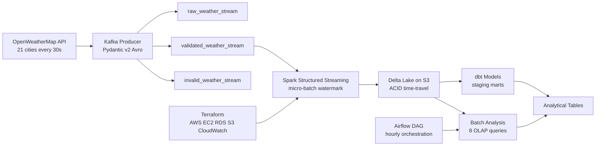

## Tech Stack

| Layer | Technology | Purpose |
|---|---|---|
| Stream Ingestion | Apache Kafka 3.5 | Real-time message queue |
| Schema Enforcement | Avro + Schema Registry | Binary serialisation and schema evolution |
| Stream Processing | Spark Structured Streaming | Micro-batch processing |
| Storage | Delta Lake on S3 | ACID lakehouse storage with time-travel |
| Transformation | dbt | SQL-based data models with lineage |
| Orchestration | Apache Airflow 2.8.1 | Pipeline scheduling and monitoring |
| Infrastructure | Terraform + AWS | Cloud provisioning as code |
| Containerisation | Docker Compose | Local development stack |
| CI/CD | GitHub Actions | Automated testing on every push |
| Language | Python 3.11 | Pipeline logic |

## Project Structure
```
spark-streaming-pipeline/
├── producer/               # Kafka producer
│   ├── schema.py           # Pydantic v2 + Avro models
│   ├── config.py           # Kafka, API and city configuration
│   ├── fetch.py            # OpenWeatherMap API client with retry logic
│   ├── weather_producer.py # Main producer with three-topic routing
│   └── weather.avsc        # Avro schema definition
├── consumer/               # Spark Structured Streaming consumer
│   ├── spark_consumer.py   # Reads from Kafka, writes to Delta Lake
│   └── processor.py        # Micro-batch transformations
├── jobs/
│   └── batch_analysis.py   # 8 OLAP analytical jobs on Delta Lake
├── dbt/                    # dbt transformation models
├── airflow/
│   └── dags/
│       └── spark_streaming_dag.py  # Hourly orchestration DAG
├── terraform/
│   └── modules/
│       ├── networking/     # VPC, subnets, security groups
│       ├── compute/        # EC2, IAM
│       └── storage/        # S3, Delta Lake buckets
├── tests/                  # 39 pytest unit tests
├── config/config.yaml      # Central configuration
├── scripts/                # Kafka topics and DB initialisation
├── docs/                   # Architecture diagrams
├── docker-compose.yml      # Full stack local setup
├── Dockerfile.producer
├── Dockerfile.consumer
├── Makefile
├── requirements.txt
└── .env.example
```

## Key Engineering Decisions

**Why Spark instead of a plain Python consumer?**
The Kafka consumer in Project 2 processes one message at a time on a single thread. That works for 12 cities. It breaks at scale. Spark processes micro-batches across multiple cores in parallel. The architecture stays the same whether you have 21 cities or 21,000. I wanted to build something I would not have to redesign later.

**Why Delta Lake instead of PostgreSQL?**
Project 2 wrote directly to PostgreSQL. It worked but analytical queries on the same database competed with writes for resources. Delta Lake separates the two concerns completely. Spark writes Parquet files to S3. The analytical layer reads them independently. Delta Lake also gives you ACID transactions, schema enforcement on write and time-travel queries. You can query the dataset as it existed at any past timestamp. PostgreSQL cannot do that without significant engineering.

**Why three Kafka topics instead of one?**
Project 2 had one topic and a dead letter queue table in PostgreSQL for failures. The problem is that routing decisions and storage decisions end up tangled together. Three topics gives each message type its own lane. Raw gets everything before validation, useful for auditing and debugging. Validated gets only clean messages, Spark reads only from here. Invalid gets failed messages, a separate process can reprocess them without touching the main pipeline at all.

**Why Avro instead of JSON?**
I used JSON in Projects 1 and 2 because it is simple. The problem with JSON at scale is that field names travel with every message. City, temperature, humidity, repeated for every single record. Avro stores the schema once in the Schema Registry and replaces field names with integer IDs in the message. A JSON weather record is around 400 bytes. The same record in Avro is around 80 bytes. 80 percent smaller means lower storage costs, higher throughput and less network load for no change in the data itself.

**Why dbt for transformations?**
Spark transformations are Python. They work but they are hard to document, test and share with non-engineers. dbt transformations are SQL files with built-in lineage tracking, column-level documentation and data tests. When another engineer picks this up, they can read a dbt model and understand exactly what it does without reading Python. The Spark layer moves data. The dbt layer explains it.

**Why Airflow?**
The streaming consumer runs continuously, no scheduling needed. But the batch analysis jobs need to run on a schedule and they have dependencies. The quality check must run after the batch analysis. The Kafka health check must run before both. Airflow manages those dependencies with retries and alerting. It also means a single Airflow deployment can orchestrate both this pipeline and the ETL pipeline from Project 1.

**Debugging the AWS deployment — five real production issues**

Deploying to AWS surfaced five issues that never appeared in local Docker testing, each requiring a different kind of fix.

*Issue 1 — AWS account free-tier instance type restriction.* The Terraform plan failed with `FreeTierRestrictionError` when attempting to launch a t3.small instance. AWS personal accounts under the free tier only permit t2.micro/t3.micro instance types regardless of available credits. Spark's JVM requires a minimum of 2GB RAM to start reliably, and t3.micro (1GB) is insufficient. After verifying the account's free-tier status in Billing settings and removing the restriction, redeploying with t3.small succeeded, and was later resized to t3.medium (4GB) for headroom running all 8 containers simultaneously.

*Issue 2 — SSH key pair mismatch after Terraform key rotation.* After regenerating the EC2 key pair via the AWS CLI, SSH authentication failed with `Permission denied (publickey)`. The root cause: an EC2 instance's authorized key is baked in at launch time from the key pair specified in Terraform — rotating the AWS key pair afterwards does not update running instances. The fix was to destroy and recreate only the EC2 instance and Elastic IP (`terraform destroy -target`), which re-launched with the new key pair while leaving the VPC, subnets, security groups and S3 bucket untouched.

*Issue 3 — Spark could not write to S3 (`ClassNotFoundException: S3AFileSystem`).* The Spark consumer started successfully and read from Kafka, but failed when writing the Delta Lake sink with `Class org.apache.hadoop.fs.s3a.S3AFileSystem not found`. The Dockerfile included the Delta Lake and Kafka connector JARs but not the `hadoop-aws` and `aws-java-sdk-bundle` JARs that provide the S3A filesystem implementation Spark needs to write to `s3a://` paths. Adding both JARs (matching the Hadoop 3.3.4 version bundled with Spark 3.5.0) to the Docker image resolved it. Verified by checking the S3 bucket directly — Spark wrote 5 Delta Lake transaction log commits and 33 Parquet partition files to `s3a://ojong-spark-streaming-delta-lake/delta/weather/` within one hour of starting.

*Issue 4 — docker-compose environment variables not propagated from `.env`.* Even after fixing the JARs, the consumer continued writing to its local default path `/tmp/delta/weather` rather than S3. The `.env` file on the EC2 instance correctly contained `DELTA_LAKE_PATH=s3a://...`, but `docker-compose.yml` defines an explicit `environment:` block per service that does not automatically forward all host environment variables — only the ones explicitly listed. Adding `DELTA_LAKE_PATH`, `CHECKPOINT_PATH`, `S3_BUCKET`, `AWS_REGION` and `AWS_DEFAULT_REGION` to the consumer service's environment block fixed it.

*Issue 5 — EC2 instance forced to replace on every `terraform apply` due to AMI drift.* The compute module used a `data "aws_ami"` lookup with `most_recent = true` to always provision the latest Amazon Linux 2023 AMI. This works for the initial deployment, but on every subsequent `terraform plan`, the data source re-resolves to whatever AMI AWS has published most recently — which is often a newer image than the one the running instance was launched with. Since `ami` is an immutable EC2 attribute, any difference forces Terraform to destroy and recreate the instance, discarding its state and requiring a full re-setup. The fix was adding a `lifecycle { ignore_changes = [ami] }` block to the instance resource — Terraform still resolves the latest AMI for brand-new deployments, but never treats a changed AMI as a reason to replace an already-running instance.

## Pipeline Metrics

| Metric | Value |
|---|---|
| Cities tracked | 21 across 6 continents |
| Kafka topics | 3 (raw, validated, invalid) |
| Spark micro-batch interval | 30 seconds |
| Delta Lake storage format | Parquet with Snappy compression |
| Test coverage | 79% |
| Unit tests | 39 across 4 files |
| Average CI run time | 49 seconds |


## Pipeline Screenshots

### Kafka UI Dashboard
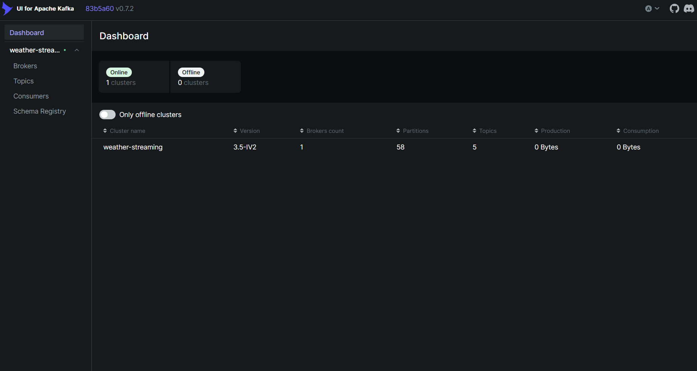
*1 cluster online — weather-streaming — Kafka 3.5-IV2 — 5 topics — 58 partitions*

### Broker Health
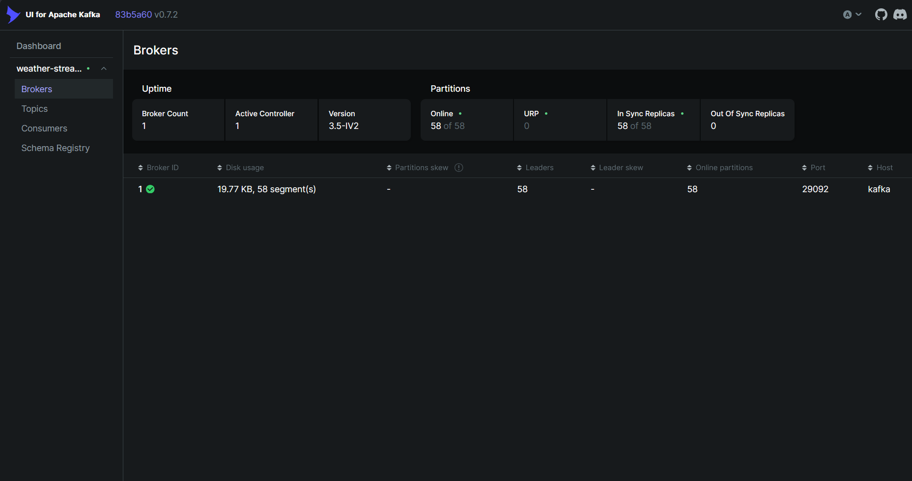
*1 broker healthy — 58/58 partitions in sync — 0 out-of-sync replicas*

### Topics Overview
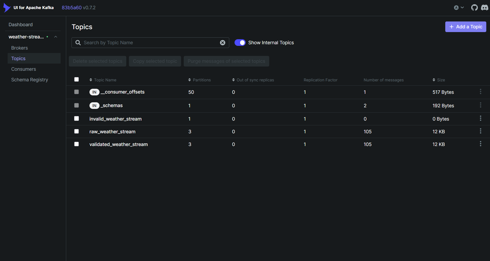
*raw_weather_stream and validated_weather_stream — 105 messages each — invalid_weather_stream 0 messages*

### Validated Messages
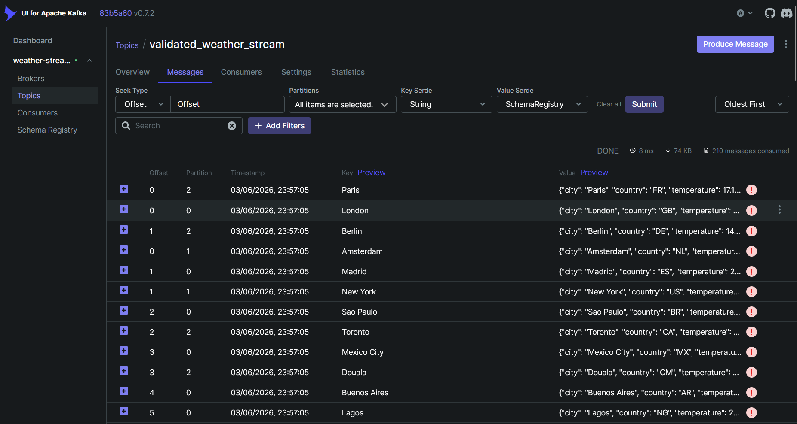
*210 messages consumed — all 21 cities with real temperature data — 0 validation failures*

### Producer Logs
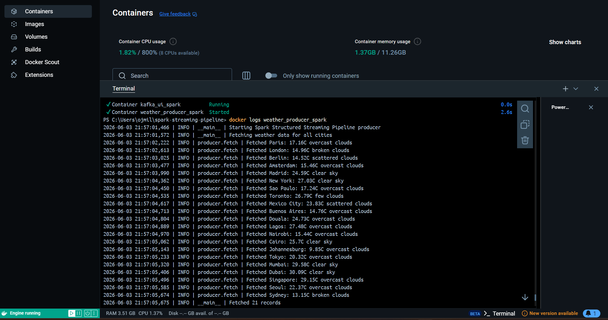
*All 21 cities fetched successfully — 21 records per cycle — producer running in Docker*

### Full Pipeline — Producer and Consumer Running
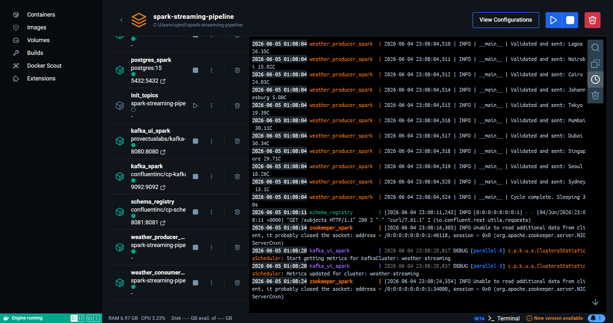
*All 10 containers running — producer and Spark consumer both active*

### Docker Desktop — Consumer Running
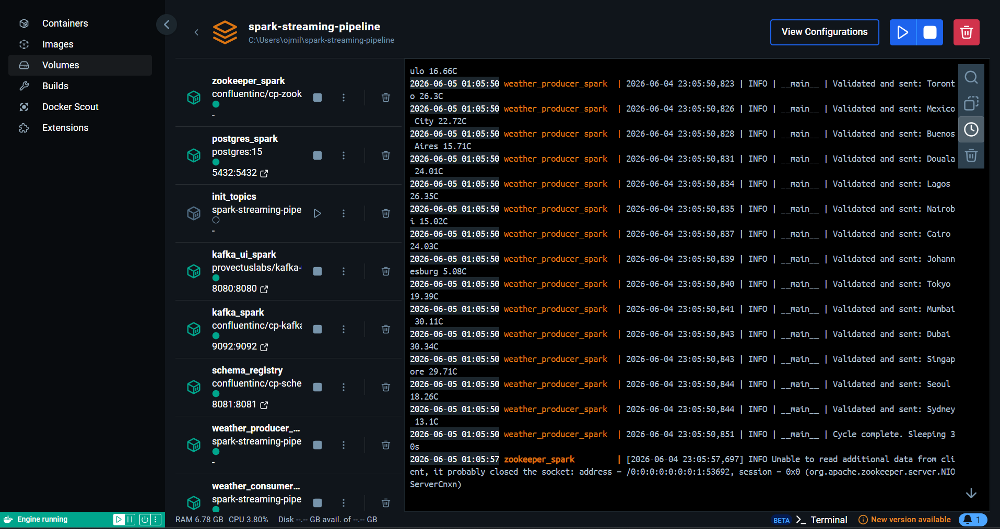
*weather_consumer_spark running alongside all pipeline services*

### Kafka Topics — 294 Messages
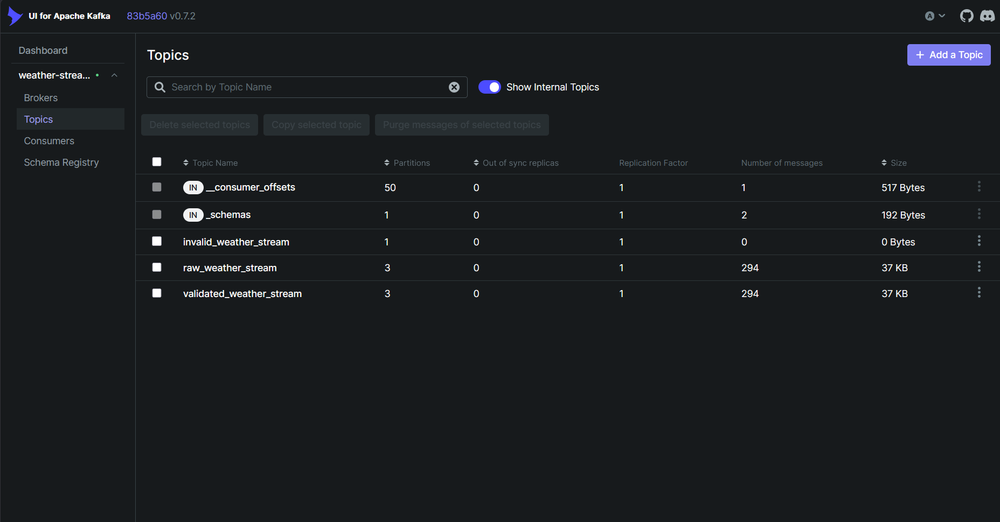
*raw_weather_stream and validated_weather_stream — 294 messages each — consumer processing live*

### Spark Consumer — Messages Consumed
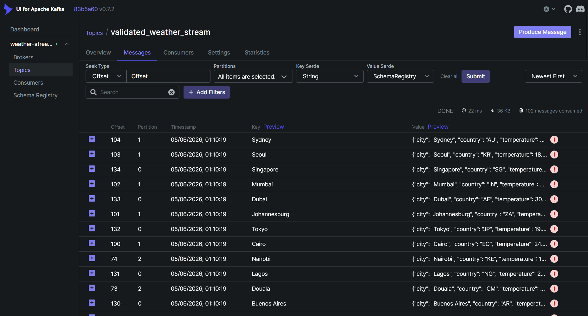
*102 messages consumed by Spark Structured Streaming — all 21 cities — Delta Lake writing to /tmp/delta/weather*

### AWS Infrastructure — EC2 Instance Running
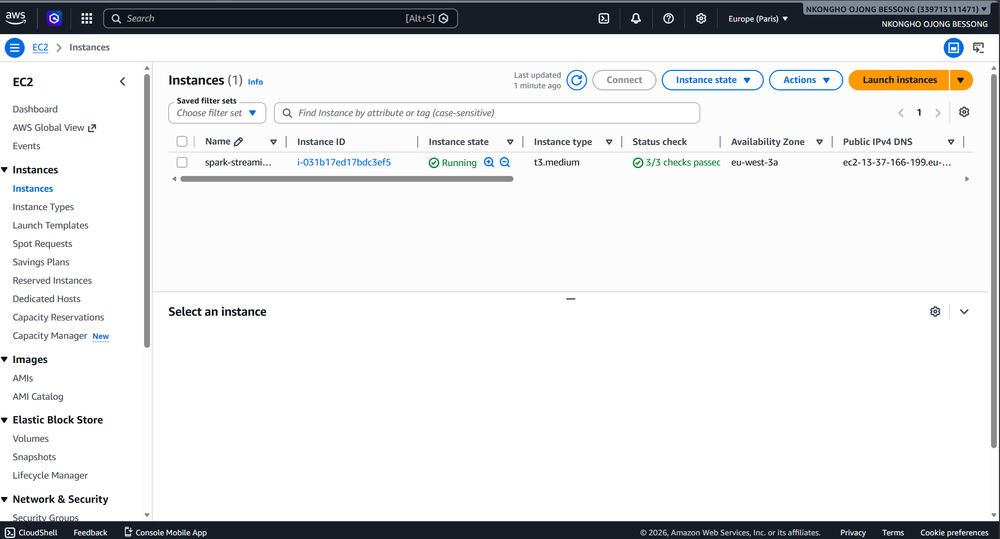
*spark-streaming-spark-ec2 — i-031b17ed17bdc3ef5 — t3.medium — Running — 3/3 checks passed — eu-west-3a*

### AWS Infrastructure — EC2 Instance Details
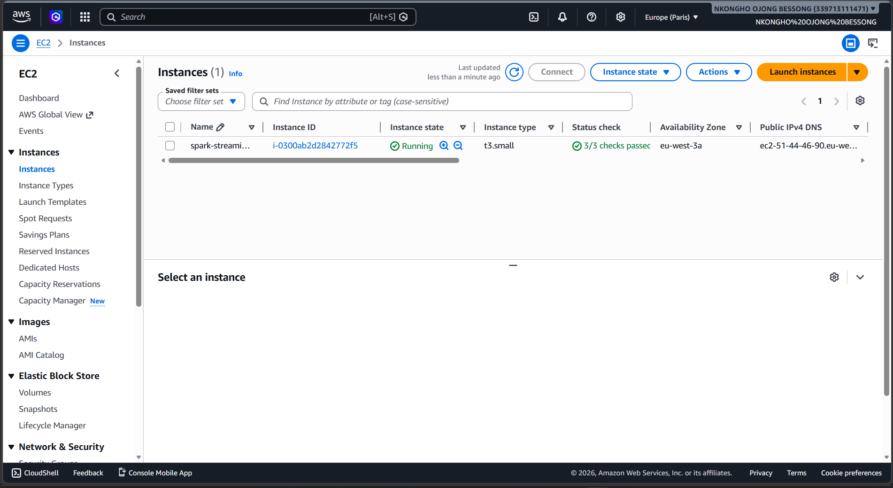
*Public IP 13.37.166.199 — Elastic IP spark-streaming-eip — IAM role spark-streaming-ec2-role — spark-streaming-vpc*

### AWS Infrastructure — S3 Delta Lake Bucket
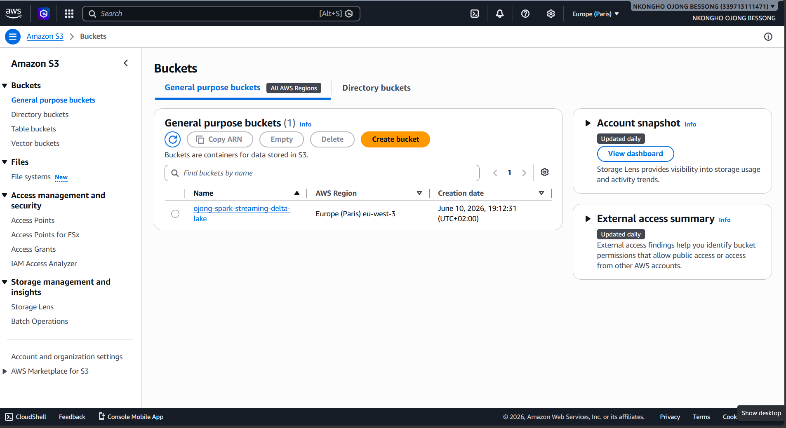
*ojong-spark-streaming-delta-lake — Europe (Paris) eu-west-3*

### AWS Infrastructure — Delta Lake Folder Structure
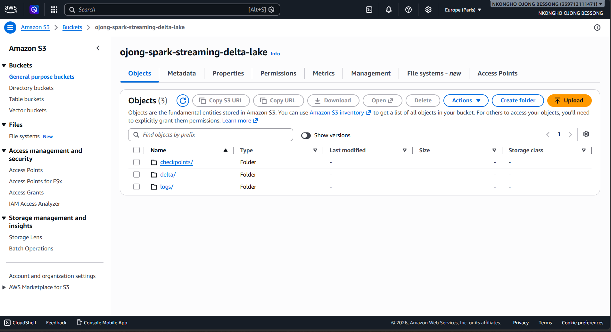
*checkpoints/, delta/, logs/ — Delta Lake folder structure provisioned by Terraform*

### AWS Infrastructure — VPC
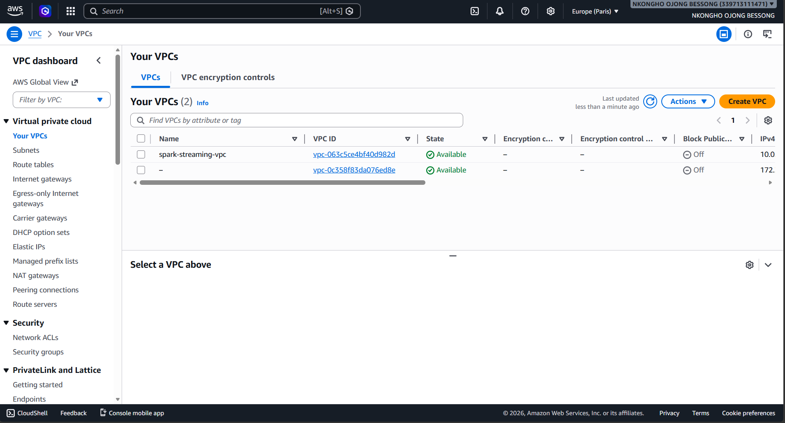
*spark-streaming-vpc — vpc-063c5ce4bf40d982d — Available — eu-west-3*

### AWS Infrastructure — VPC Details
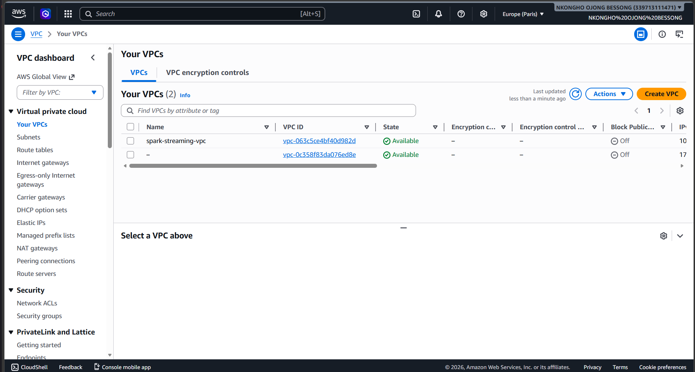
*Route tables, subnets and network ACLs provisioned by Terraform*

### AWS — Spark Structured Streaming Writing to S3 Delta Lake
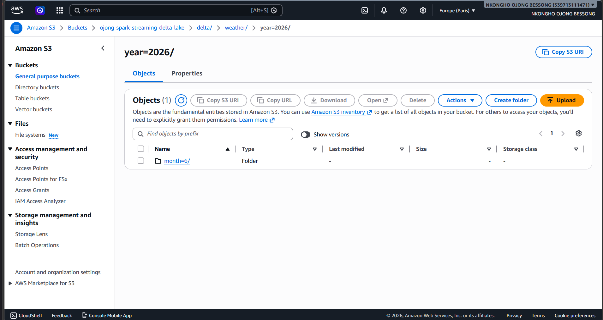
*78 Parquet files in delta/weather/year=2026/month=6/day=11/hour=14/ — Spark Structured Streaming actively writing micro-batches to S3 Delta Lake from EC2*


## 📍 Status

**In active development — June 2026**

**Completed:**
- ✅ Kafka producer — 21 cities, Pydantic v2 validation, Avro serialisation, three-topic routing
- ✅ Spark Structured Streaming consumer — micro-batch processing, watermarking, checkpointing
- ✅ dbt staging model and city weather summary mart with column-level tests
- ✅ Full Docker Compose stack — 10 services running locally with `make up`
- ✅ 39 pytest unit tests, 79% coverage, CI green
- ✅ Terraform modules — networking, compute, storage — 23 AWS resources provisioned in eu-west-3
- ✅ AWS deployment — EC2 t3.medium running full pipeline, S3 Delta Lake bucket live
- ✅ Spark Structured Streaming confirmed writing live to S3 Delta Lake on AWS — verified across two separate sessions, with 78 Parquet files written to a single hourly partition
- ✅ CloudWatch monitoring — CPU and status check alarms with SNS email notifications

**In progress:**
- 🔄 Airflow orchestration DAG

**Upcoming:**
- 🔲 Add Airflow and dbt services to Docker Compose for end-to-end orchestration

---

## 🔗 Portfolio Context

This is the fifth and most advanced project in my data engineering portfolio — bringing together everything from the previous four into a single unified stack.

| Project | What it does | Stack |
|---|---|---|
| [Weather ETL Pipeline](https://github.com/OjongBessongNKONGHO/weather-etl-pipeline) | Batch ETL — hourly weather data pipeline | Airflow, PostgreSQL, Docker |
| [Kafka Streaming Pipeline](https://github.com/OjongBessongNKONGHO/kafka-streaming-pipeline) | Real-time streaming — Kafka producer/consumer | Kafka, Pydantic v2, PostgreSQL, Docker |
| [AWS Data Platform](https://github.com/OjongBessongNKONGHO/aws-data-platform) | Cloud infrastructure for the above pipelines | Terraform, AWS, IaC |
| [DuckDB Analytics](https://github.com/OjongBessongNKONGHO/duckdb-analytics) | Analytical layer — 10 OLAP queries on pipeline data | DuckDB, Pandas, PyArrow, Click |
| **Spark Streaming Pipeline** (this repo) | Unified stack — Spark, Delta Lake, dbt, Airflow, Terraform | Spark, Kafka, Delta Lake, dbt, Airflow, Terraform |

---

## 👤 Author

**Ojong Bessong NKONGHO**
Data Engineering Student — DSTI School of Engineering, Paris
Seeking Data Engineering internship (July 2026) and apprenticeship (September 2026)

[](https://linkedin.com/in/nkongho-ojong)
[](https://github.com/OjongBessongNKONGHO)