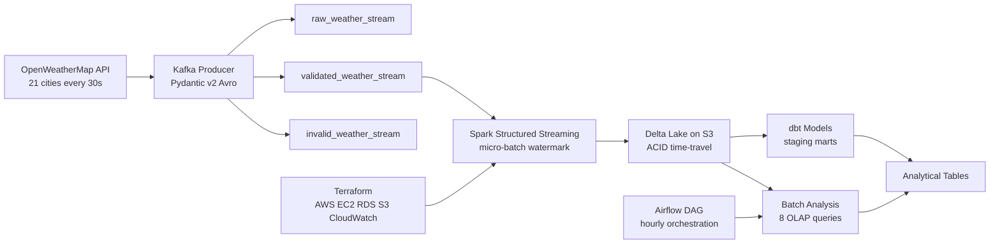

# Spark Structured Streaming Pipeline


A production-grade real-time data engineering pipeline built with Apache Spark Structured Streaming. A Kafka producer continuously streams live weather data for 21 cities across 6 continents, Spark consumes and processes it in micro-batches, Delta Lake provides ACID storage with time-travel, dbt transforms the data into analytical models, Airflow orchestrates the workflow, and Terraform provisions the AWS infrastructure.

Built as Project 5 of my Data Engineering portfolio, extending Projects 1 to 4 into a unified modern data stack.

## Architecture



## Tech Stack

| Layer | Technology | Purpose |
|---|---|---|
| Stream Ingestion | Apache Kafka 3.5 | Real-time message queue |
| Schema Enforcement | Avro + Schema Registry | Binary serialisation and schema evolution |
| Stream Processing | Spark Structured Streaming | Micro-batch processing |
| Storage | Delta Lake on S3 | ACID lakehouse storage with time-travel |
| Transformation | dbt | SQL-based data models with lineage |
| Orchestration | Apache Airflow 2.8.1 | Pipeline scheduling and monitoring |
| Infrastructure | Terraform + AWS | Cloud provisioning as code |
| Containerisation | Docker Compose | Local development stack |
| CI/CD | GitHub Actions | Automated testing on every push |
| Language | Python 3.11 | Pipeline logic |

## Project Structure
spark-streaming-pipeline/
├── producer/               # Kafka producer
│   ├── schema.py           # Pydantic v2 + Avro models
│   ├── config.py           # Kafka, API and city configuration
│   ├── fetch.py            # OpenWeatherMap API client with retry logic
│   ├── weather_producer.py # Main producer with three-topic routing
│   └── weather.avsc        # Avro schema definition
├── consumer/               # Spark Structured Streaming consumer
│   ├── spark_consumer.py   # Reads from Kafka, writes to Delta Lake
│   └── processor.py        # Micro-batch transformations
├── jobs/
│   └── batch_analysis.py   # 8 OLAP analytical jobs on Delta Lake
├── dbt/                    # dbt transformation models
├── airflow/
│   └── dags/
│       └── spark_streaming_dag.py  # Hourly orchestration DAG
├── terraform/
│   └── modules/
│       ├── networking/     # VPC, subnets, security groups
│       ├── compute/        # EC2, IAM
│       └── storage/        # S3, Delta Lake buckets
├── tests/                  # 39 pytest unit tests
├── config/config.yaml      # Central configuration
├── scripts/                # Kafka topics and DB initialisation
├── docker-compose.yml      # Full stack local setup
├── Dockerfile.producer
├── Dockerfile.consumer
├── Makefile
├── requirements.txt
└── .env.example

## Pipeline Metrics

| Metric | Value |
|---|---|
| Cities tracked | 21 across 6 continents |
| Kafka topics | 3 (raw, validated, invalid) |
| Spark micro-batch interval | 30 seconds |
| Delta Lake storage | ACID with time-travel |
| Airflow schedule | Hourly |
| Unit tests | 39 across 4 files |
| CI status | GitHub Actions passing |

## How to Run

Prerequisites: Docker Desktop and OpenWeatherMap API key

```bash
cp .env.example .env
# Add your API key to .env
make up
```

Monitor the pipeline:

| Tool | URL | Purpose |
|---|---|---|
| Kafka UI | http://localhost:8080 | Topic and message monitoring |
| Producer logs | docker logs weather_producer_spark -f | Live producer output |
| Consumer logs | docker logs weather_consumer_spark -f | Spark micro-batch output |

## Status

In active development — June 2026

## Author

Ojong Bessong NKONGHO
Data Engineering Student — DSTI School of Engineering, Paris
Seeking Data Engineering internship (July 2026) and apprenticeship (September 2026)

LinkedIn: linkedin.com/in/nkongho-ojong
GitHub: github.com/OjongBessongNKONGHO
