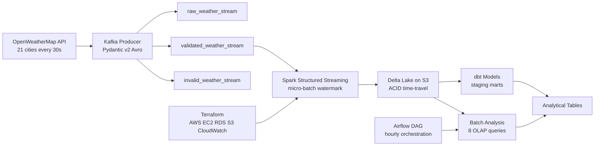

# Spark Structured Streaming Pipeline


A production-grade real-time data engineering pipeline built with Apache Spark Structured Streaming. A Kafka producer streams live weather data for 21 cities across 6 continents into three Kafka topics, Spark processes it in micro-batches and writes to Delta Lake, dbt models the analytical layer, Airflow orchestrates the scheduled jobs, and Terraform provisions the AWS infrastructure.

This is the fifth project in my data engineering portfolio. The first four covered batch ETL, real-time streaming, cloud infrastructure and OLAP analytics. This one brings all four together into a single unified stack.

## Architecture



## Tech Stack

| Layer | Technology | Purpose |
|---|---|---|
| Stream Ingestion | Apache Kafka 3.5 | Real-time message queue |
| Schema Enforcement | Avro + Schema Registry | Binary serialisation and schema evolution |
| Stream Processing | Spark Structured Streaming | Micro-batch processing |
| Storage | Delta Lake on S3 | ACID lakehouse storage with time-travel |
| Transformation | dbt | SQL-based data models with lineage |
| Orchestration | Apache Airflow 2.8.1 | Pipeline scheduling and monitoring |
| Infrastructure | Terraform + AWS | Cloud provisioning as code |
| Containerisation | Docker Compose | Local development stack |
| CI/CD | GitHub Actions | Automated testing on every push |
| Language | Python 3.11 | Pipeline logic |

## Project Structure
```
spark-streaming-pipeline/
├── producer/               # Kafka producer
│   ├── schema.py           # Pydantic v2 + Avro models
│   ├── config.py           # Kafka, API and city configuration
│   ├── fetch.py            # OpenWeatherMap API client with retry logic
│   ├── weather_producer.py # Main producer with three-topic routing
│   └── weather.avsc        # Avro schema definition
├── consumer/               # Spark Structured Streaming consumer
│   ├── spark_consumer.py   # Reads from Kafka, writes to Delta Lake
│   └── processor.py        # Micro-batch transformations
├── jobs/
│   └── batch_analysis.py   # 8 OLAP analytical jobs on Delta Lake
├── dbt/                    # dbt transformation models
├── airflow/
│   └── dags/
│       └── spark_streaming_dag.py  # Hourly orchestration DAG
├── terraform/
│   └── modules/
│       ├── networking/     # VPC, subnets, security groups
│       ├── compute/        # EC2, IAM
│       └── storage/        # S3, Delta Lake buckets
├── tests/                  # 39 pytest unit tests
├── config/config.yaml      # Central configuration
├── scripts/                # Kafka topics and DB initialisation
├── docs/                   # Architecture diagrams
├── docker-compose.yml      # Full stack local setup
├── Dockerfile.producer
├── Dockerfile.consumer
├── Makefile
├── requirements.txt
└── .env.example
```

## Key Engineering Decisions

**Why Spark instead of a plain Python consumer?**
The Kafka consumer in Project 2 processes one message at a time on a single thread. That works for 12 cities. It breaks at scale. Spark processes micro-batches across multiple cores in parallel. The architecture stays the same whether you have 21 cities or 21,000. I wanted to build something I would not have to redesign later.

**Why Delta Lake instead of PostgreSQL?**
Project 2 wrote directly to PostgreSQL. It worked but analytical queries on the same database competed with writes for resources. Delta Lake separates the two concerns completely. Spark writes Parquet files to S3. The analytical layer reads them independently. Delta Lake also gives you ACID transactions, schema enforcement on write and time-travel queries. You can query the dataset as it existed at any past timestamp. PostgreSQL cannot do that without significant engineering.

**Why three Kafka topics instead of one?**
Project 2 had one topic and a dead letter queue table in PostgreSQL for failures. The problem is that routing decisions and storage decisions end up tangled together. Three topics gives each message type its own lane. Raw gets everything before validation, useful for auditing and debugging. Validated gets only clean messages, Spark reads only from here. Invalid gets failed messages, a separate process can reprocess them without touching the main pipeline at all.

**Why Avro instead of JSON?**
I used JSON in Projects 1 and 2 because it is simple. The problem with JSON at scale is that field names travel with every message. City, temperature, humidity, repeated for every single record. Avro stores the schema once in the Schema Registry and replaces field names with integer IDs in the message. A JSON weather record is around 400 bytes. The same record in Avro is around 80 bytes. 80 percent smaller means lower storage costs, higher throughput and less network load for no change in the data itself.

**Why dbt for transformations?**
Spark transformations are Python. They work but they are hard to document, test and share with non-engineers. dbt transformations are SQL files with built-in lineage tracking, column-level documentation and data tests. When another engineer picks this up, they can read a dbt model and understand exactly what it does without reading Python. The Spark layer moves data. The dbt layer explains it.

**Why Airflow?**
The streaming consumer runs continuously, no scheduling needed. But the batch analysis jobs need to run on a schedule and they have dependencies. The quality check must run after the batch analysis. The Kafka health check must run before both. Airflow manages those dependencies with retries and alerting. It also means a single Airflow deployment can orchestrate both this pipeline and the ETL pipeline from Project 1.

## Pipeline Metrics

| Metric | Value |
|---|---|
| Cities tracked | 21 across 6 continents |
| Kafka topics | 3 (raw, validated, invalid) |
| Spark micro-batch interval | 30 seconds |
| Delta Lake storage format | Parquet with Snappy compression |
| Test coverage | 79% |
| Unit tests | 39 across 4 files |
| Average CI run time | 49 seconds |

## How to Run

Prerequisites: Docker Desktop and OpenWeatherMap API key

```bash
cp .env.example .env
# Add your API key to .env
make up
```

Monitor the pipeline:

| Tool | URL | Purpose |
|---|---|---|
| Kafka UI | http://localhost:8080 | Topic and message monitoring |
| Producer logs | docker logs weather_producer_spark -f | Live producer output |
| Consumer logs | docker logs weather_consumer_spark -f | Spark micro-batch output |

## Status

In active development, June 2026

Next milestones: dbt staging models, Terraform module implementation and AWS deployment.

## Author

Ojong Bessong NKONGHO
Data Engineering Student, DSTI School of Engineering, Paris
Seeking Data Engineering internship (July 2026) and apprenticeship (September 2026)

LinkedIn: linkedin.com/in/nkongho-ojong
GitHub: github.com/OjongBessongNKONGHO
